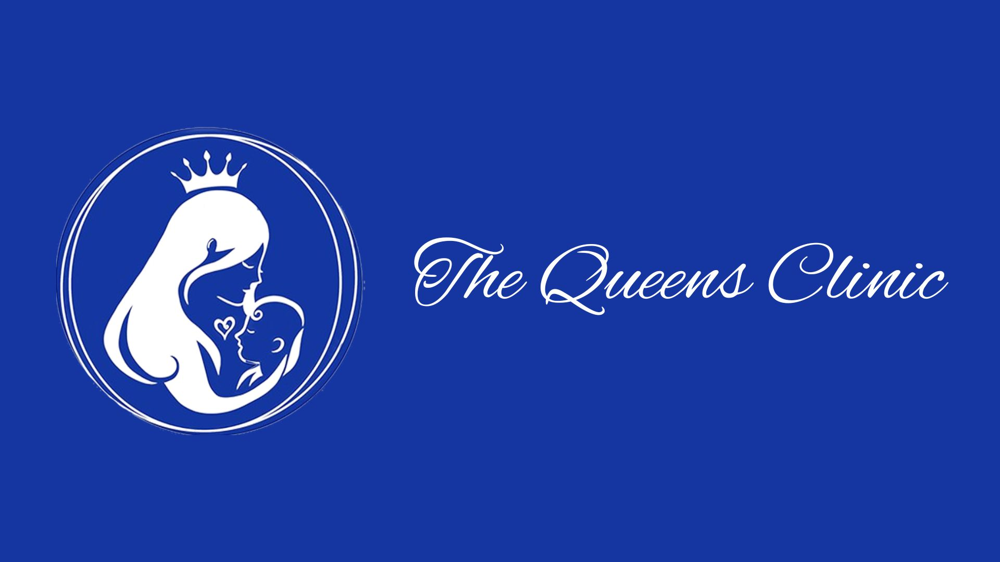
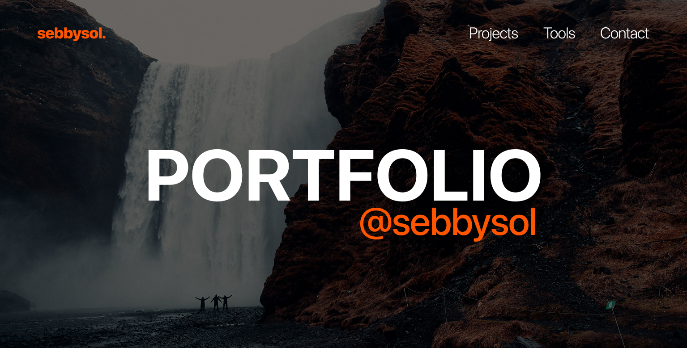
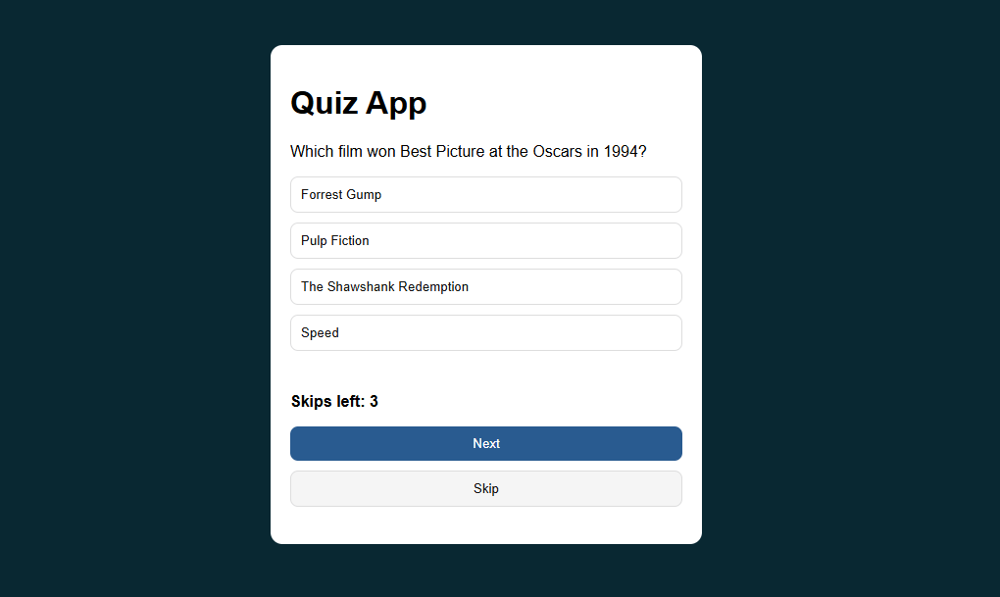
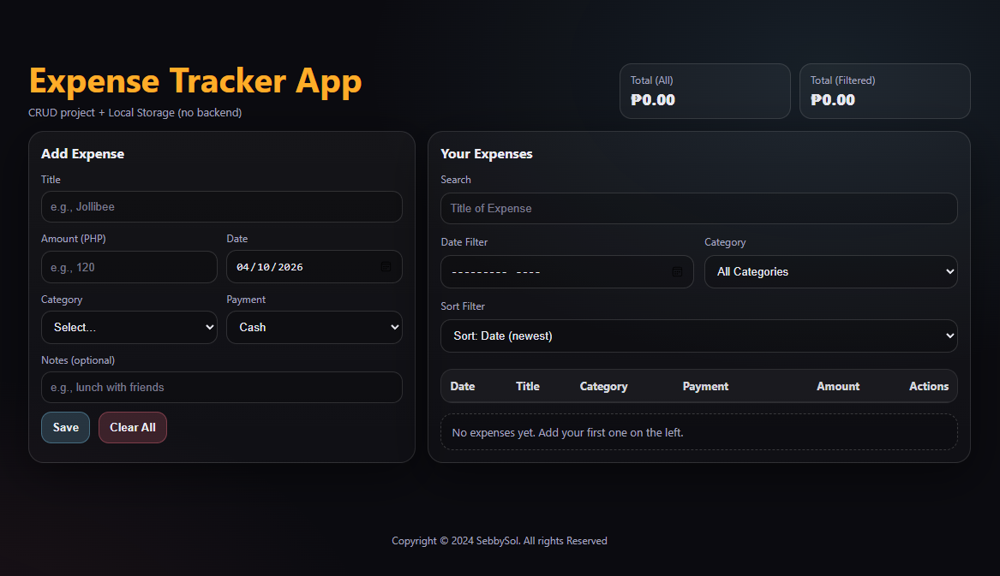

<h1><b>Hi there, I'm </b><a href="https://github.com/SebbySol">Seb</a> 

</h1>
 

<!-- About me -->
&nbsp;***About me***

I'm **(Sebastian Miguel S. Angeles)** — a **Bachelor of Science in Information Technology - Web and Mobile Application Development** student at **FEU Institute of Technology**.  
I specialize in **Full-Stack Web Development** and **UI/UX Design**, building modern, responsive, and user-centered applications that combine clean code with intuitive, visually appealing interfaces.  

I’m passionate about turning ideas into **functional, scalable, and user-focused applications**. Currently, I’m enhancing my portfolio and working on full-stack projects that challenge both my technical and design skills.

- 🌐 I stay inspired by developer communities like Stack Overflow, Dev.to, and GitHub
- 🧠 Currently learning: MERN Stack, REST APIs, and Full-stack project architecture
- 📫 Reach me at: <a href="mailto:sebastianangeles14@gmail.com">sebastianangeles14@gmail.com </a>

 

###### Design & Prototyping:
&nbsp;
&nbsp;
&nbsp;
&nbsp;
&nbsp;

###### Frontend Development:
&nbsp;
&nbsp;
&nbsp;
&nbsp;

###### Tech Stack currently using:
&nbsp;
&nbsp;

###### Development Tools:
&nbsp;
&nbsp;

###### Platforms & Hosting:
&nbsp;
&nbsp;
 
 

<!-- My Projects -->
&nbsp; ***My Projects***

<table>
  <tr>
    <td width="50%">
      <h3 align="center">TQC: A Web-Based EHR & Scheduling System</h3>
      

        
          
        
<strong>TQC</strong> is an electronic health record and scheduling system built for The Queen’s Birthing Home Clinic. It replaces traditional recordkeeping with a digital solution featuring OCR scanning and an intuitive UI. I served as the Web Designer and Front-End Developer.

      

    </td>
  </tr>

  <tr>
    <td width="50%">
      <h3 align="center">Portfolio</h3>
      

         
          
        
A modern, fully responsive portfolio designed to showcase my journey as a web developer. Built with a focus on clean architecture and user experience, this project leverages HTML5 and CSS3 for structure and custom styling, while utilizing Bootstrap to ensure a seamless experience across all device sizes. It serves as a central hub for my latest projects and technical skills.

      

    </td>
  </tr>

  <tr>
    <td width="50%">
      <h3 align="center">Simple Quiz App</h3>
      

         
          
        
A dynamic Simple Quiz App that challenges users with a variety of general knowledge questions. This project highlights the use of JavaScript for question randomization and real-time score tracking, paired with a clean, responsive UI built using HTML and CSS. It focuses on providing a seamless user experience with instant feedback and mobile-first compatibility

      

    </td>
  </tr>

  <tr>
    <td width="50%">
      <h3 align="center">Expense Tracker</h3>
      

         
          
        
A streamlined personal finance tool that allows users to track their spending and income. Built with HTML, CSS, and JavaScript, it features a dynamic list of transactions and utilizes Local Storage to save data locally on the user's device. The UI is designed for simplicity, providing a clear overview of financial health at a glance.

      

    </td>
  </tr>
  
</table>
 

 

<!-- Visitor Counter -->
 

    
    
    

 
 

